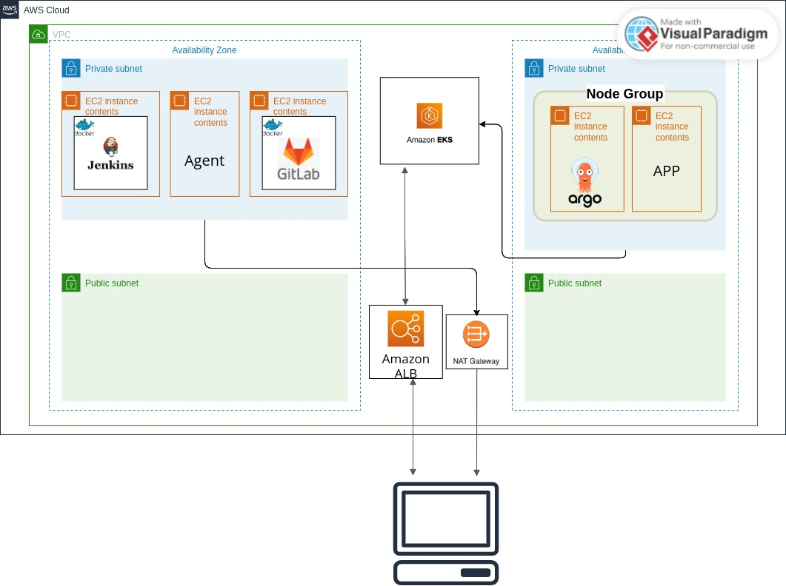

# CI/CD pipeline

## Description

Welcome to my project! This repository contains the CI/CD pipeline for my "Hello World" application built with Python. The pipeline automates the process of testing, building, and deploying the app, ensuring that any changes made to the code are quickly and efficiently integrated into the production environment.

## Tools Used

- **Terraform**: A tool used to build and provision all the infrastructure on the cloud provider (AWS).
  - VPC (Virtual Private Cloud): A custom network within AWS that includes subnets, route tables, and internet gateways, ensuring secure and isolated networking for the application.
  - ALB (Application Load Balancer): A load balancer that distributes incoming traffic to the EC2 instances.
  - EKS (Elastic Kubernetes Service): A managed Kubernetes service running ArgoCD and the containerized application.
  - EC2 Instances: Virtual servers provisioned to host Jenkins, Agent, and other services.
- **AWS**: The cloud provider that provides all the cloud resources for this project.
- **Docker**: A containerization tool that runs the application, Jenkins and other services inside EC2 instances.
- **Jenkins**: A CI server that automates the process of building and testing the application.
- **Gitlab**: A version control system (VCS) that provides two repositories: one for the app’s code and one for the Kubernetes manifest files.
- **ArgoCD**: A CD server that manages deployments and tracks changes in the Kubernetes manifest files.

## Getting Started

- **Clone the Repository**

```
  git clone https://github.com/Shlomiish/Migdal_Project.git
```

- **Configure AWS**

```
aws configure
```

- **Run Terraform**

```
aws configure
terraform init
terraform plan
terraform apply
```

- **Login to ArgoCD**
  - The default username for ArgoCD is: admin

```
aws eks update-kubeconfig --region eu-north-1 --name my-eks-cluster

kubectl -n argocd get secret argocd-initial-admin-secret -o jsonpath="{.data.password}" | base64 -d

```
